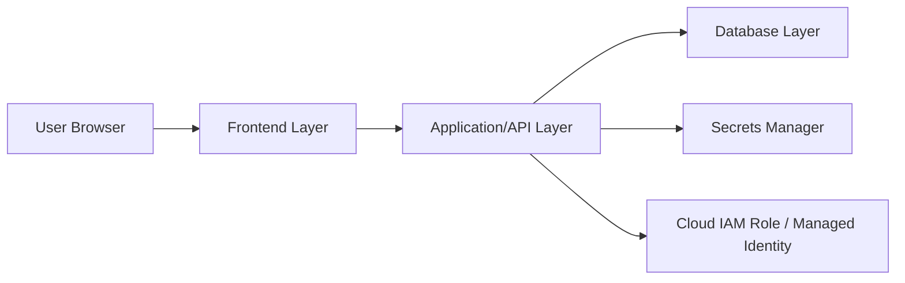

# Cloud Application Security Capstone

This repository is for a three-tier cloud application security project.

The goal is to build a simple working application, deploy it to a cloud environment, document its insecure baseline state, apply security controls, and measure the security improvement with evidence.

## Research Focus

This project focuses on the first two course themes:

1. Identity, Access, and Secrets
2. Network Exposure and Perimeter Controls

The application itself should stay simple. The main value of the project is the security investigation: before-state evidence, implemented controls, after-state evidence, and clear explanation.

## High-Level Architecture

## Repository Layout

- `frontend/` - user interface code or setup notes.
- `backend/` - API/application layer code or setup notes.
- `database/` - schema, seed data, and database setup notes.
- `infrastructure/` - cloud architecture, deployment notes, and security configuration.
- `docs/` - RA1 outline, project plan, timeline, and architecture notes.
- `evidence/` - before/after test results, screenshots, command outputs, and experiment notes.

## Suggested Build Strategy

1. Build the simplest possible three-tier app locally.
2. Deploy it to the cloud in a baseline state.
3. Document what is insecure or overly exposed.
4. Apply identity, secrets, and network controls.
5. Re-run the same tests after the controls.
6. Compare the results in tables and diagrams.

## Important Safety Rule

Do not commit real credentials, database passwords, private keys, access tokens, or cloud account secrets. Use `.env.example` files for safe placeholders only.

