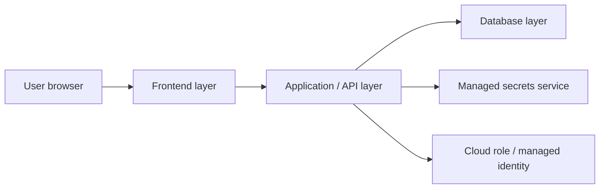

# SecureWallet Cloud Security Assessment

An evidence-driven security assessment of a three-tier cloud application,
focused on identity, secrets, and network exposure.

> **Status:** In progress. The application and assessment plan are present.
> Cloud deployment, control implementation, and before/after evidence are not
> yet complete. Findings in this repository should be read as planned
> validation until supporting evidence is added.

## Executive Summary

Cloud applications are often exposed by configuration choices rather than
complex software flaws. This project investigates whether least-privilege
identity, managed secrets, and restricted network access reduce the attack
surface of a three-tier application.

The application provides a controlled lab environment for comparing an
intentionally insecure baseline with a hardened design. Each control will be
evaluated using reproducible tests and documented evidence, rather than relying
only on configuration screenshots.

## Security Question

> To what extent do least-privilege identity, managed secrets, and restricted
> network access reduce credential exposure and unauthorized access risk in a
> cloud-hosted three-tier application?

## Assessment Scope

| Included | Excluded |
| --- | --- |
| Frontend, API, and database trust boundaries | Production-scale load testing |
| Application identity and permissions | Multi-cloud comparison |
| Secret storage and retrieval | Advanced malware detection |
| Network ingress and layer-to-layer access | Real personal or financial data |
| Before/after control validation | Attacks against external systems |

## Architecture


```mermaid
flowchart LR
  User["User browser"] --> Frontend["Frontend layer"]
  Frontend --> Backend["Application / API layer"]
  Backend --> Database["Database layer"]
  Backend --> Secrets["Managed secrets service"]
  Backend --> Identity["Cloud role / managed identity"]
```

Expected trust boundaries:

- The frontend is the only intended public application entry point.
- The API accepts traffic only from approved sources.
- The database accepts traffic only from the application layer.
- The application retrieves required secrets through a scoped cloud identity.

See [architecture notes](docs/architecture.md) for the layer responsibilities.

## Investigation Method

For each control area, the assessment follows the same workflow:

1. Define the expected secure behavior.
2. Reproduce and document the insecure baseline.
3. Explain the risk and likely impact.
4. Apply a focused security control.
5. Repeat the original test.
6. Record the result, limitations, and recommended next action.

## Control Validation Plan

| Test | Baseline risk | Control | Expected validation evidence | Status |
| --- | --- | --- | --- | --- |
| Secret storage | Credentials stored in local configuration | Move secrets to a managed service | Config diff and successful application test without local secret | Planned |
| Application permissions | Application identity has broad access | Apply a least-privilege role | Required action succeeds; unrelated secret access fails | Planned |
| Database exposure | Database is reachable from an untrusted network | Restrict database ingress to API layer | External connection fails; API-to-database connection succeeds | Planned |
| Backend exposure | Unnecessary services are reachable | Close unused ports and restrict sources | Before/after exposure test | Planned |

The full assessment plan is in [docs/security-plan.md](docs/security-plan.md).
Evidence will be organized under [`evidence/`](evidence/README.md).

## Current Observations

The current application is suitable only as an intentionally insecure lab
baseline:

- Demo credentials are stored directly in application code.
- Authentication state is global and is not suitable for concurrent users.
- Passwords are compared as plaintext.
- Synthetic personal and financial-like fields are returned by the demo API.
- Persistence, cloud identity, managed secrets, and perimeter controls are not
  yet implemented.

These observations are not presented as completed cloud findings. They define
the starting conditions the assessment must address and validate.

## Repository Map

| Path | Purpose |
| --- | --- |
| [`frontend/`](frontend/) | React user interface |
| [`backend/`](backend/) | Express API and intentionally insecure baseline |
| [`database/`](database/) | Database design notes |
| [`infrastructure/`](infrastructure/) | Cloud and network control notes |
| [`docs/`](docs/) | Research question, architecture, and security plan |
| [`evidence/`](evidence/) | Sanitized before/after test evidence |

## Run the Local Lab

Requirements: Node.js and npm.

```bash
cd backend
npm install
npm start
```

In a second terminal:

```bash
cd frontend
npm install
npm start
```

The default local frontend is available at `http://localhost:3000`; the API
uses port `5001`.

## Evidence Standards

- Use only synthetic data and systems you are authorized to test.
- Redact account identifiers and sensitive configuration values.
- Never commit real credentials, tokens, private keys, or cloud exports.
- Preserve enough context for another analyst to reproduce the test.
- State limitations and inconclusive results instead of overstating findings.

## Planned Deliverables

- Baseline attack-surface and trust-boundary assessment
- Before/after IAM and secrets-management validation
- Before/after network-exposure validation
- Prioritized findings with risk, evidence, remediation, and retest results
- Final assessment summary for both technical and non-technical readers

## Disclaimer

This repository is an educational security lab. It is intentionally incomplete
and is not designed or approved for production use.
